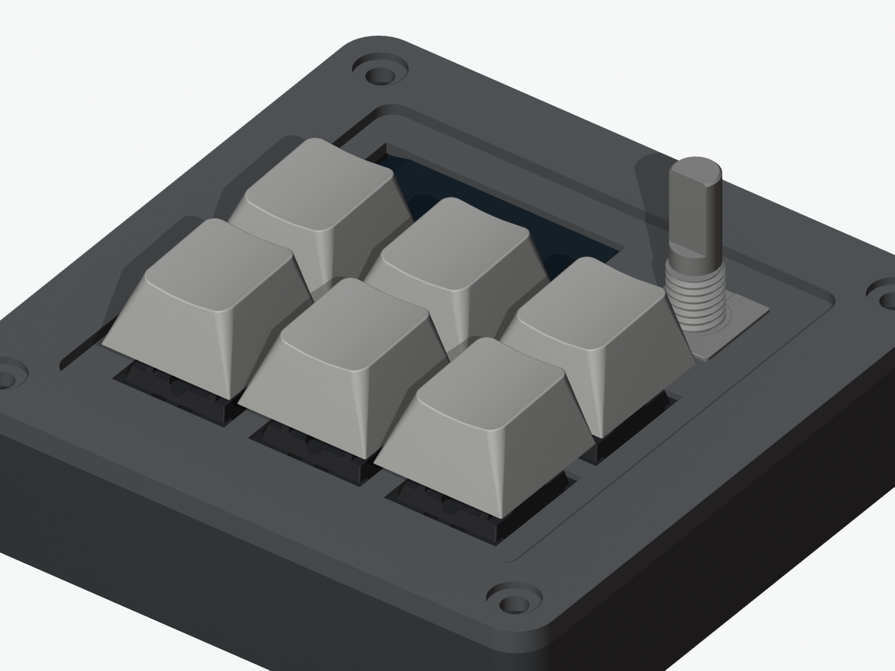
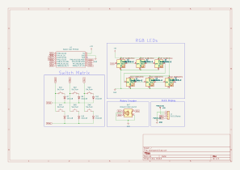
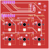
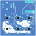

# Starboard

Starboard is a compact Hackpad macropad using only kit parts: six MX-style switches, one EC11 encoder, one 0.91 inch OLED, six SK6812 MINI-E LEDs, and a Seeed XIAO RP2040.

**Live demo → <https://deveworld.github.io/starboard/>** — interactive 3D viewer, specs, and downloads.

The current case model is `CAD/assembled-model.STEP`, which includes the case and assembled components.

## Renders / Screenshots

| Schematic | PCB front | PCB back |
| :---: | :---: | :---: |
|  |  |  |

## Bill of Materials

| Part | Qty |
| --- | ---: |
| Seeed XIAO RP2040 | 1 |
| MX-style mechanical switch | 6 |
| Blank DSA keycap | 6 |
| EC11 rotary encoder, 20mm D-shaft | 1 |
| 0.91 inch 128x32 OLED display | 1 |
| SK6812 MINI-E RGB LED | 6 |
| 1N4148 through-hole diode | 6 |
| M3x16mm screw | 4 |
| M3x5x4mm heatset insert | 4 |

## Design Summary

- PCB size: 63.0 x 63.0 mm, 2 layers
- Case size: 83.8 x 83.8 x 18.5 mm
- Inputs: 6 switches + 1 encoder
- MCU: Seeed XIAO RP2040
- Case: fully 3D printed sandwich case, top plate + bottom shell
- Switch plate: 1.5 mm thick, 14.2 x 14.2 mm MX cutouts
- Top shell: integrated 3.0 mm reinforced perimeter with screw head counterbores
- Fasteners: M3x16 screws into M3x5x4 heatset inserts

## Firmware

- QMK source: `Firmware/qmk/starboard/`
- Production archive: `production/firmware-qmk.zip`
- Prebuilt UF2: `production/firmware.uf2`
- Build command: `qmk compile -kb starboard -km default`
- Features: 6-key matrix, encoder rotation, encoder press, SSD1306 OLED, SK6812 RGB lighting
- Wireless note: the current XIAO RP2040 hardware has no BLE radio; ZMK wireless should be reserved for a future BLE-controller revision.

## Submission Files

- `CAD/assembled-model.STEP`
- `Firmware/qmk/starboard/`
- `PCB/starboard.kicad_pro`
- `PCB/starboard.kicad_sch`
- `PCB/starboard.kicad_pcb`
- `production/firmware-qmk.zip`
- `production/gerbers.zip`
- `production/firmware.uf2`
- `production/Top.STEP`
- `production/Bottom.STEP`

## Verification

- ERC: 0 errors, 6 symbol-library mismatch warnings for SK6812 cache copies.
- DRC: 0 errors, 0 unconnected pads, 0 schematic parity issues; remaining warnings are silkscreen/cosmetic.
- Case V5 fit audit: all boolean clash and clearance checks pass.
- Firmware package: `keyboard.json` parses successfully, `production/firmware-qmk.zip` passes zip integrity check, and QMK compile succeeds for `starboard:default`.
